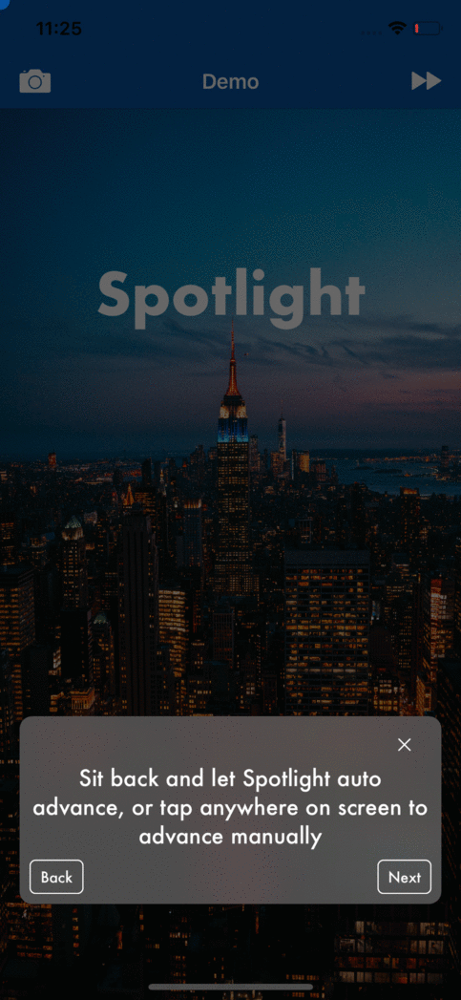

# Spotlight
Introductory walkthrough framework for iOS Apps (inspired by [Gecco](https://github.com/yukiasai/Gecco), Rewrite to make it simpler)



## Usage

Setting up Spotlight is really simple and takes only a few lines of code. There are convenience initializers for views and bar buttons and more choices.

``` swift
import LRSpotlight

class ViewController: UIViewController {

    override func viewDidAppear(_ animated: Bool) {
        super.viewDidAppear(animated)
        startIntro()
    }

    func startIntro() {
        let nodes = [SpotlightNode(text: "Show Spotlight on a Bar button item", target: .barButton(navigationItem.rightBarButtonItem)),
        SpotlightNode(text: "Show Spotlight on a View", target: .view(nameLabel)),
        SpotlightNode(text: "Show Spotlight at a point location", target: .point(CGPoint(x: 100, y: 100), radius: 50))]

        Spotlight().startIntro(from: self, withNodes: nodes)
    }

}
```

## Installation

#### CocoaPods

```
pod 'LRSpotlight'
```
#### Carthage

```
github "lekshmiraveendranath/Spotlight"
```

### Configurations
```swift
// Change the delay between spotlights (defaults to 3 seconds)
Spotlight.delay = 5.0 
// Change the animation duration for spotlight appearance (Defaults to 0.25 seconds)
Spotlight.animationDuration = 0.1
// Display a background for the info text view (defaults to true)
Spotlight.showInfoBackground = true
```

## Features

- [x] Easy to integrate, just few lines of code
- [x] Code based Spotlights, no need for an additional storyboard scene per screen for laying out text as in Gecco
- [x] Timer based automatic forwarding (configurable)
- [x] Convenience initializers for views, bar buttons, tab bar items, plus spotlights using points or rects
- [x] Compatible with UI Version testing, since Spotlights are displayed over UI elements at runtime
- [x] Swift 4
